```mermaid
graph TD
    %% Bronze Schema
    subgraph "Bronze Schema (edw_bronze)"
        Customer_Bronze["customer"]
        Lineitem_Bronze["lineitem"]
        Nation_Bronze["nation"]
        Orders_Bronze["orders"]
        Part_Bronze["part"]
        Partsupp_Bronze["partsupp"]
        Region_Bronze["region"]
        Supplier_Bronze["supplier"]
    end
    
    %% Silver Pipeline
    subgraph "Silver Pipeline (silver_load)"
        Customer_Silver_Flow["🔄 customer_silver_dim"]
        Lineitem_Silver_Flow["🔄 lineitem_silver_fct"]
        Nation_Silver_Flow["🔄 nation_silver_dim"]
        Orders_Silver_Flow["🔄 orders_silver_fct"]
        Part_Silver_Flow["🔄 part_silver_dim"]
        Partsupp_Silver_Flow["🔄 partsupp_silver_dim"]
        Region_Silver_Flow["🔄 region_silver_dim"]
        Supplier_Silver_Flow["🔄 supplier_silver_dim"]
    end
    
    %% Silver Schema
    subgraph "Silver Schema (edw_silver)"
        subgraph "Dimensions (SCD Type 2)"
            Customer_Silver["customer_dim<br/>(CDC + SCD Type 2)"]
            Nation_Silver["nation_dim<br/>(CDC + SCD Type 2)"]
            Part_Silver["part_dim<br/>(CDC + SCD Type 2)"]
            Partsupp_Silver["partsupp_dim<br/>(CDC + SCD Type 2)"]
            Region_Silver["region_dim<br/>(CDC + SCD Type 2)"]
            Supplier_Silver["supplier_dim<br/>(CDC + SCD Type 2)"]
        end
        subgraph "Facts (SCD Type 1)"
            Lineitem_Silver["lineitem_fct<br/>(CDC + SCD Type 1)"]
            Orders_Silver["orders_fct<br/>(CDC + SCD Type 1)"]
        end
    end
    
    %% Connections
    Customer_Bronze --> Customer_Silver_Flow --> Customer_Silver
    Lineitem_Bronze --> Lineitem_Silver_Flow --> Lineitem_Silver
    Nation_Bronze --> Nation_Silver_Flow --> Nation_Silver
    Orders_Bronze --> Orders_Silver_Flow --> Orders_Silver
    Part_Bronze --> Part_Silver_Flow --> Part_Silver
    Partsupp_Bronze --> Partsupp_Silver_Flow --> Partsupp_Silver
    Region_Bronze --> Region_Silver_Flow --> Region_Silver
    Supplier_Bronze --> Supplier_Silver_Flow --> Supplier_Silver
    
    style Customer_Silver fill:#e8f5e8
    style Nation_Silver fill:#e8f5e8
    style Part_Silver fill:#e8f5e8
    style Partsupp_Silver fill:#e8f5e8
    style Region_Silver fill:#e8f5e8
    style Supplier_Silver fill:#e8f5e8
    style Lineitem_Silver fill:#e3f2fd
    style Orders_Silver fill:#e3f2fd
```

# ACMI EDW - Lakehouse Plumber Sample Project

A **LakehousePlumber** Delta Live Tables (DLT) pipeline project for processing TPC-H benchmark data using a medallion architecture.

## Overview

This project implements a complete data lakehouse solution for the TPC-H benchmark dataset using [**LakehousePlumber (lhp)**](https://github.com/Mmodarre/Lakehouse_Plumber) to generate Delta Live Tables pipelines. The project follows a medallion architecture pattern with **raw ingestion**, **bronze**, **silver**, and **gold** layers.

The solution processes 8 core TPC-H tables:
- `customer` - Customer dimension data
- `lineitem` - Order line items fact data  
- `nation` - Nation dimension data
- `orders` - Orders fact data
- `part` - Part dimension data
- `partsupp` - Part supplier dimension data
- `region` - Region dimension data
- `supplier` - Supplier dimension data

## Todo

- [ ] Add Applend flow with multiple sources writing to the same table (for now using append_flow for single source to each table)
- [ ] Add once=True for nation and region tables (for now using Auto_cdc_flow)
- [ ] Add presets demonstration (currently presets are not used)
- [ ] Add SQL file for SQL queries (for now using inline SQL queries in the pipeline)
- [ ] Add Python transformation for demonstration.

## Architecture

### Medallion Architecture Layers

1. **Raw Ingestion Layer** (`01_raw_ingestion/`)
   - Ingests data from multiple formats (CSV, JSON, Parquet)
   - Supports streaming ingestion with schema hints
   - Adds operational metadata (file paths, timestamps, record hashes)

2. **Bronze Layer** (`02_bronze/`)
   - Cleanses and standardizes raw data
   - Applies data quality expectations
   - Implements SCD Type 2 for dimension tables

3. **Silver Layer** (`03_silver/`)
   - Creates business-ready, conformed data
   - Implements Change Data Capture (CDC) flows
   - Maintains historical data with SCD Type 2

4. **Gold Layer** (`04_gold/`)
   - Business aggregations and reporting tables
   - Optimized for analytical queries

### Data Quality

The project implements comprehensive data quality checks:
- **Fail Actions**: Critical validations that stop pipeline execution
- **Warn Actions**: Non-critical validations that log warnings
- **Expectations**: Defined in `expectations/` directory as JSON files

Example quality checks for customer data:
- Valid customer keys (NOT NULL, > 0)
- Valid customer names (NOT NULL, length > 0)
- Valid nation keys 
- Phone format validation
- Account balance range checks
- Market segment validation

## Project Structure

```
acmi_edw/
├── pipelines/              # Pipeline configurations organized by layer
│   ├── 01_raw_ingestion/   # Raw data ingestion configs
│   │   ├── csv_ingestions/     # CSV file ingestion
│   │   ├── json_ingestion/     # JSON file ingestion  
│   │   └── parquet_ingestions/ # Parquet file ingestion
│   ├── 02_bronze/          # Bronze layer transformations
│   │   ├── dim/               # Dimension tables
│   │   └── fct/               # Fact tables
│   ├── 03_silver/          # Silver layer transformations
│   │   ├── dim/               # Dimension tables
│   │   └── fct/               # Fact tables
│   └── 04_gold/            # Gold layer aggregations
├── generated/              # Generated DLT pipeline code
├── schemas/                # Table schema definitions (YAML)
├── expectations/           # Data quality expectations (JSON)
├── templates/              # Reusable pipeline templates
├── substitutions/          # Environment-specific configurations
├── presets/                # Reusable configuration presets
└── lhp.yaml               # Main project configuration
```

## Pipeline Organization

This project demonstrates a **layer-based pipeline organization** strategy, where each medallion layer constitutes a separate DLT pipeline:

### Current Organization Structure

| Layer | Pipeline Name | Description |
|-------|---------------|-------------|
| Raw Ingestion | `raw_ingestions` | All table ingestion flows |
| Bronze | `bronze_load` | All bronze transformations |
| Silver | `silver_load` | All silver CDC flows |
| Gold | `gold_aggregations` | All gold aggregations |

### Pipeline Organization Strategies

LakehousePlumber supports multiple pipeline organization approaches:

#### 1. **Layer-Based Organization** (Current Approach)
```yaml
# All raw ingestion flows
pipeline: raw_ingestions
flowgroup: customer_ingestion

# All bronze transformations  
pipeline: bronze_load
flowgroup: customer_bronze_dim
```

**Benefits:**
- Clear separation of concerns by data layer
- Easier to manage layer-specific configurations
- Simplified deployment and monitoring per layer
- Better resource management per layer

**Considerations:**
- Single pipeline failure affects all tables in that layer
- Potential resource contention for large datasets

#### 2. **Table-Based Organization**
```yaml
# Customer-specific pipeline
pipeline: customer_pipeline
flowgroup: customer_ingestion

# Orders-specific pipeline
pipeline: orders_pipeline  
flowgroup: orders_ingestion
```

**Benefits:**
- Independent processing and failure isolation per table
- Table-specific resource allocation
- Parallel processing of different tables
- Easier troubleshooting and debugging

**Considerations:**
- More pipelines to manage and monitor
- Potential resource overhead with many small pipelines

#### 3. **Domain-Based Organization**
```yaml
# Customer domain (customer, nation, region)
pipeline: customer_domain
flowgroup: customer_processing

# Sales domain (orders, lineitem)
pipeline: sales_domain
flowgroup: orders_processing

# Product domain (part, partsupp, supplier)
pipeline: product_domain
flowgroup: part_processing
```

**Benefits:**
- Logical grouping of related business entities
- Domain-specific resource allocation
- Better alignment with business ownership
- Balanced pipeline sizes

#### 4. **Hybrid Organization**
```yaml
# Critical tables get their own pipelines
pipeline: lineitem_pipeline  # Largest fact table
pipeline: orders_pipeline    # High-volume fact table

# Smaller dimensions share pipelines
pipeline: dimensions_pipeline # customer, nation, region, etc.
```

### Choosing the Right Organization

Consider these factors when selecting a pipeline organization strategy:

| Factor | Layer-Based | Table-Based | Domain-Based | Hybrid |
|--------|-------------|-------------|--------------|--------|
| **Simplicity** | ✅ High | ❌ Low | ⚠️ Medium | ⚠️ Medium |
| **Failure Isolation** | ❌ Low | ✅ High | ⚠️ Medium | ✅ High |
| **Resource Optimization** | ⚠️ Medium | ✅ High | ✅ High | ✅ High |
| **Monitoring Complexity** | ✅ Low | ❌ High | ⚠️ Medium | ⚠️ Medium |
| **Development Complexity** | ✅ Low | ⚠️ Medium | ⚠️ Medium | ❌ High |

### Migration Between Organizations

To migrate from the current layer-based to a different organization:

1. **Update pipeline names** in YAML configurations
2. **Reorganize directory structure** (optional)
3. **Update dependencies** between pipelines
4. **Regenerate DLT code** with new organization
5. **Update deployment scripts** and monitoring

Example migration to table-based organization:
```bash
# Update pipeline configurations
sed -i 's/pipeline: raw_ingestions/pipeline: customer_pipeline/' pipelines/*/customer_*.yaml

# Regenerate code
lhp generate --env dev

# Deploy new pipeline structure
```

### Best Practices for Pipeline Organization

1. **Start Simple**: Begin with layer-based organization for new projects
2. **Monitor Performance**: Watch for bottlenecks and resource contention
3. **Consider Data Volume**: Large fact tables may benefit from dedicated pipelines
4. **Plan for Growth**: Design organization that scales with data volume
5. **Document Dependencies**: Clear documentation of inter-pipeline dependencies
6. **Test Thoroughly**: Validate all data flows after organization changes

## Gold Layer Table Structures

The gold layer contains business-ready analytics tables implemented as materialized views. Here are the currently implemented gold layer tables:

### 📊 **Sales & Revenue Analytics**

#### `sales_summary_daily_mv`
```sql
-- Daily sales performance metrics with SCD Type 2 dimension joins
SELECT 
    order_date,
    COUNT(DISTINCT o.order_id) as total_orders,
    COUNT(DISTINCT c.customer_id) as unique_customers,
    SUM(total_price) as total_revenue,
    AVG(total_price) as avg_order_value,
    SUM(CASE WHEN order_status = 'F' THEN 1 ELSE 0 END) as fulfilled_orders,
    SUM(CASE WHEN order_status = 'O' THEN 1 ELSE 0 END) as open_orders
FROM {catalog}.{silver_schema}.orders_fct o
JOIN {catalog}.{silver_schema}.customer_dim c ON o.customer_id = c.customer_id
  AND o.order_date >= c.__start_at 
  AND (o.order_date < c.__end_at OR c.__end_at IS NULL)
GROUP BY order_date
```

#### `sales_summary_monthly_mv`
```sql
-- Monthly sales aggregations
SELECT 
    YEAR(order_date) as year,
    MONTH(order_date) as month,
    SUM(total_price) as monthly_revenue,
    COUNT(DISTINCT o.order_id) as monthly_orders,
    COUNT(DISTINCT c.customer_id) as monthly_customers,
    AVG(total_price) as avg_monthly_order_value
FROM {catalog}.{silver_schema}.orders_fct o
GROUP BY YEAR(order_date), MONTH(order_date)
```

#### `revenue_by_region_mv`
```sql
-- Revenue analysis by geographic region with SCD Type 2 dimension joins
SELECT 
    r.name as region_name,
    n.name as nation_name,
    DATE_TRUNC('month', o.order_date) as month,
    SUM(o.total_price) as region_revenue,
    COUNT(DISTINCT o.order_id) as region_orders,
    COUNT(DISTINCT c.customer_id) as region_customers
FROM {catalog}.{silver_schema}.orders_fct o
JOIN {catalog}.{silver_schema}.customer_dim c ON o.customer_id = c.customer_id
  AND o.order_date >= c.__start_at 
  AND (o.order_date < c.__end_at OR c.__end_at IS NULL)
JOIN {catalog}.{silver_schema}.nation_dim n ON c.nation_id = n.nation_id
  AND o.order_date >= n.__start_at 
  AND (o.order_date < n.__end_at OR n.__end_at IS NULL)
JOIN {catalog}.{silver_schema}.region_dim r ON n.region_id = r.region_id
  AND o.order_date >= r.__start_at 
  AND (o.order_date < r.__end_at OR r.__end_at IS NULL)
GROUP BY r.name, n.name, DATE_TRUNC('month', o.order_date)
```

### 🛒 **Customer Analytics**

#### `customer_lifetime_value_mv`
```sql
-- Customer lifetime value and behavior metrics with SCD Type 2 dimension joins
SELECT 
    c.customer_id,
    c.name as customer_name,
    c.market_segment,
    n.name as nation,
    COUNT(DISTINCT o.order_id) as total_orders,
    SUM(o.total_price) as lifetime_value,
    AVG(o.total_price) as avg_order_value,
    MIN(o.order_date) as first_order_date,
    MAX(o.order_date) as last_order_date,
    DATEDIFF(MAX(o.order_date), MIN(o.order_date)) as customer_tenure_days
FROM {catalog}.{silver_schema}.customer_dim c
JOIN {catalog}.{silver_schema}.orders_fct o ON c.customer_id = o.customer_id
  AND o.order_date >= c.__start_at 
  AND (o.order_date < c.__end_at OR c.__end_at IS NULL)
JOIN {catalog}.{silver_schema}.nation_dim n ON c.nation_id = n.nation_id
  AND o.order_date >= n.__start_at 
  AND (o.order_date < n.__end_at OR n.__end_at IS NULL)
GROUP BY c.customer_id, c.name, c.market_segment, n.name
```

### 📦 **Product Analytics**

#### `product_performance_mv`
```sql
-- Product sales performance and popularity metrics by month with SCD Type 2 dimension joins
SELECT 
    p.part_id,
    p.name as product_name,
    p.manufacturer,
    p.brand,
    p.type,
    COUNT(DISTINCT l.order_id) as orders_count,
    SUM(l.quantity) as total_quantity_sold,
    SUM(l.extended_price) as total_revenue,
    AVG(l.extended_price / l.quantity) as avg_unit_price,
    SUM(l.extended_price * l.discount) as total_discount_given,
    AVG(l.discount) as avg_discount_rate,
    DATE_TRUNC('month', o.order_date) as month
FROM {catalog}.{silver_schema}.lineitem_fct l
JOIN {catalog}.{silver_schema}.orders_fct o ON l.order_id = o.order_id
JOIN {catalog}.{silver_schema}.part_dim p ON l.part_id = p.part_id
  AND o.order_date >= p.__start_at 
  AND (o.order_date < p.__end_at OR p.__end_at IS NULL)
GROUP BY p.part_id, p.name, p.manufacturer, p.brand, p.type, DATE_TRUNC('month', o.order_date)
```

### 🎯 **Executive Dashboard (Composite MV)**

#### `executive_dashboard_mv`
```sql
-- Executive dashboard that reads from multiple existing MVs
WITH monthly_sales AS (
  SELECT 
    year, month, monthly_revenue, monthly_orders, monthly_customers,
    LAG(monthly_revenue, 1) OVER (ORDER BY year, month) as prev_month_revenue,
    LAG(monthly_orders, 1) OVER (ORDER BY year, month) as prev_month_orders
  FROM {catalog}.{gold_schema}.sales_summary_monthly_mv
),
regional_performance AS (
  SELECT 
    month, COUNT(DISTINCT region_name) as active_regions,
    SUM(region_revenue) as total_regional_revenue,
    AVG(region_revenue) as avg_regional_revenue
  FROM {catalog}.{gold_schema}.revenue_by_region_mv
  GROUP BY month
),
customer_metrics AS (
  SELECT 
    COUNT(*) as total_customers,
    AVG(lifetime_value) as avg_customer_lifetime_value,
    AVG(total_orders) as avg_orders_per_customer
  FROM {catalog}.{gold_schema}.customer_lifetime_value_mv
),
top_products AS (
  SELECT 
    month, COUNT(DISTINCT part_id) as active_products,
    SUM(total_revenue) as product_revenue,
    SUM(total_quantity_sold) as total_units_sold
  FROM {catalog}.{gold_schema}.product_performance_mv
  GROUP BY month
)
SELECT 
  ms.year, ms.month,
  ms.monthly_revenue, ms.prev_month_revenue,
  -- Growth calculations
  CASE WHEN ms.prev_month_revenue > 0 THEN 
    ROUND((ms.monthly_revenue - ms.prev_month_revenue) / ms.prev_month_revenue * 100, 2)
  ELSE NULL END as revenue_growth_pct,
  -- Combined metrics from all MVs
  ms.monthly_orders, ms.monthly_customers,
  cm.avg_customer_lifetime_value, cm.avg_orders_per_customer,
  rp.active_regions, rp.total_regional_revenue,
  tp.active_products, tp.product_revenue,
  -- Executive KPIs
  ROUND(ms.monthly_revenue / ms.monthly_customers, 2) as revenue_per_customer,
  ROUND(ms.monthly_revenue / ms.monthly_orders, 2) as revenue_per_order,
  CURRENT_TIMESTAMP() as dashboard_updated_at
FROM monthly_sales ms
LEFT JOIN regional_performance rp ON ms.year = YEAR(rp.month) AND ms.month = MONTH(rp.month)
LEFT JOIN top_products tp ON ms.year = YEAR(tp.month) AND ms.month = MONTH(tp.month)
CROSS JOIN customer_metrics cm
WHERE ms.year >= YEAR(DATE_SUB(CURRENT_DATE(), INTERVAL 24 MONTH))
ORDER BY ms.year, ms.month
```

#### `customer_segmentation_mv`
```sql
-- RFM customer segmentation that reads from customer_lifetime_value_mv
WITH customer_scores AS (
  SELECT 
    customer_id, customer_name, market_segment, nation,
    lifetime_value, total_orders, avg_order_value, customer_tenure_days,
    
    -- Calculate recency score (days since last order)
    CASE 
      WHEN DATEDIFF(CURRENT_DATE(), last_order_date) <= 30 THEN 5
      WHEN DATEDIFF(CURRENT_DATE(), last_order_date) <= 90 THEN 4
      WHEN DATEDIFF(CURRENT_DATE(), last_order_date) <= 180 THEN 3
      WHEN DATEDIFF(CURRENT_DATE(), last_order_date) <= 365 THEN 2
      ELSE 1
    END as recency_score,
    
    -- Calculate frequency score (number of orders)
    CASE 
      WHEN total_orders >= 10 THEN 5
      WHEN total_orders >= 5 THEN 4
      WHEN total_orders >= 3 THEN 3
      WHEN total_orders >= 2 THEN 2
      ELSE 1
    END as frequency_score,
    
    -- Calculate monetary score (lifetime value)
    CASE 
      WHEN lifetime_value >= 10000 THEN 5
      WHEN lifetime_value >= 5000 THEN 4
      WHEN lifetime_value >= 2000 THEN 3
      WHEN lifetime_value >= 500 THEN 2
      ELSE 1
    END as monetary_score
    
  FROM {catalog}.{gold_schema}.customer_lifetime_value_mv
)
SELECT 
  customer_id, customer_name, market_segment, nation,
  lifetime_value, total_orders, avg_order_value, customer_tenure_days,
  recency_score, frequency_score, monetary_score,
  CONCAT(recency_score, frequency_score, monetary_score) as rfm_score,
  
  -- Customer segment based on RFM analysis
  CASE 
    WHEN recency_score >= 4 AND frequency_score >= 4 AND monetary_score >= 4 THEN 'Champions'
    WHEN recency_score >= 3 AND frequency_score >= 3 AND monetary_score >= 3 THEN 'Loyal Customers'
    WHEN recency_score >= 4 AND frequency_score >= 2 AND monetary_score >= 2 THEN 'Potential Loyalists'
    WHEN recency_score >= 4 AND frequency_score <= 1 AND monetary_score <= 2 THEN 'New Customers'
    WHEN recency_score <= 2 AND frequency_score >= 2 AND monetary_score >= 3 THEN 'At Risk'
    WHEN recency_score <= 1 AND frequency_score >= 3 AND monetary_score >= 4 THEN 'Cannot Lose Them'
    WHEN recency_score <= 1 AND frequency_score <= 1 AND monetary_score <= 2 THEN 'Hibernating'
    ELSE 'Others'
  END as customer_segment,
  
  -- Segment priority (1 = highest priority)
  CASE 
    WHEN recency_score >= 4 AND frequency_score >= 4 AND monetary_score >= 4 THEN 1  -- Champions
    WHEN recency_score <= 1 AND frequency_score >= 3 AND monetary_score >= 4 THEN 2  -- Cannot Lose Them
    WHEN recency_score <= 2 AND frequency_score >= 2 AND monetary_score >= 3 THEN 3  -- At Risk
    ELSE 4
  END as segment_priority,
  
  CURRENT_TIMESTAMP() as segmentation_updated_at
  
FROM customer_scores
ORDER BY segment_priority, lifetime_value DESC
```

### 📋 **Implementation Details**

All gold layer tables are implemented as **materialized views** using the `gold_load` pipeline:

#### Base Materialized Views (Read from Silver Layer)
| Table | Type | Pipeline | Description |
|-------|------|----------|-------------|
| `sales_summary_daily_mv` | Materialized View | `gold_load` | Daily sales KPIs |
| `sales_summary_monthly_mv` | Materialized View | `gold_load` | Monthly sales aggregations |
| `revenue_by_region_mv` | Materialized View | `gold_load` | Regional revenue analysis |
| `customer_lifetime_value_mv` | Materialized View | `gold_load` | Customer behavior metrics |
| `product_performance_mv` | Materialized View | `gold_load` | Product performance metrics |

#### Composite Materialized Views (Read from Other Gold MVs)
| Table | Type | Pipeline | Description | Source MVs |
|-------|------|----------|-------------|------------|
| `executive_dashboard_mv` | Materialized View | `gold_load` | Executive dashboard with combined KPIs | `sales_summary_monthly_mv`, `revenue_by_region_mv`, `customer_lifetime_value_mv`, `product_performance_mv` |
| `customer_segmentation_mv` | Materialized View | `gold_load` | RFM customer segmentation analysis | `customer_lifetime_value_mv` |

### 🏗️ **Layered MV Architecture**

This project demonstrates a **layered materialized view architecture**:

```
Silver Layer (Source Tables)
    ↓
Base Gold MVs (Read from Silver)
    ↓
Composite Gold MVs (Read from Base MVs)
    ↓
Analytics & Dashboards
```

**Benefits:**
- **Modular Design**: Each MV has a specific purpose and can be reused
- **Performance**: Composite MVs pre-aggregate data from multiple sources
- **Maintainability**: Changes to base MVs automatically propagate to composite MVs
- **Flexibility**: Easy to create new composite views for different use cases

### 💡 **Gold Layer Best Practices**

- **Materialized Views**: All tables use materialized views for optimal query performance
- **Business-Centric**: Tables are designed around specific business questions and KPIs
- **Denormalized**: Pre-joined tables eliminate complex joins during analysis
- **Aggregated**: Pre-calculated metrics for fast dashboard queries
- **Consistent Naming**: All tables use `_mv` suffix to indicate materialized views
- **SCD Type 2 Support**: All dimension joins include temporal validity using `__start_at` and `__end_at` columns

### 🕒 **SCD Type 2 Dimension Joins**

All dimension joins follow the SCD Type 2 pattern to ensure temporal consistency:

```sql
JOIN dimension_table d ON fact.dimension_key = d.dimension_key 
  AND fact.transaction_date >= d.__start_at 
  AND (fact.transaction_date < d.__end_at OR d.__end_at IS NULL)
```

This ensures that:
- **Historical Accuracy**: Each fact record joins to the dimension record that was valid at the time of the transaction
- **Data Integrity**: Changes to dimension attributes over time are properly handled
- **Temporal Consistency**: Reports reflect the state of dimensions as they existed when transactions occurred

**Example**: A customer's market segment may change over time. Orders from January should use the customer's January market segment, not their current segment.

## Data Flow Architecture

The following diagrams show the data flow architecture across all four layers of the medallion architecture.

### 🔄 **End-to-End Data Flow**


### 🔸 **Raw Ingestion Layer (`raw_ingestions` pipeline)**


### 🟡 **Bronze Layer (`bronze_load` pipeline)**


### ⚪ **Silver Layer (`silver_load` pipeline)**


### 🟣 **Gold Layer (`gold_load` pipeline)**


## Data Sources and Formats

| Table     | Format  | Description |
|-----------|---------|-------------|
| customer  | CSV     | Customer dimension with demographic data |
| lineitem  | CSV     | Order line items (largest fact table) |
| nation    | CSV     | Nation dimension |
| orders    | CSV     | Orders fact table |
| part      | JSON    | Part dimension |
| partsupp  | JSON    | Part supplier relationships |
| region    | Parquet | Region dimension |
| supplier  | Parquet | Supplier dimension |

## Environments

The project supports multiple environments:

- **dev** - Development environment (`acmi_edw_dev` catalog)
- **tst** - Test environment  
- **prod** - Production environment

Environment-specific configurations are defined in `substitutions/` directory.

## Getting Started

### Prerequisites

- Databricks workspace with Unity Catalog enabled
- LakehousePlumber CLI installed
- Access to TPC-H dataset files
- Appropriate secrets configured in Databricks

### Setup

1. **Configure your environment**:
   ```bash
   # Edit substitutions/dev.yaml for your environment
   # Update catalog, schema, and volume paths
   ```

2. **Validate your configuration**:
   ```bash
   lhp validate --env dev
   ```

3. **Generate DLT pipeline code**:
   ```bash
   lhp generate --env dev
   ```

4. **Deploy to Databricks**:
   - Upload generated Python files to Databricks
   - Create DLT pipelines using the generated code
   - Configure compute and storage settings

### Running Pipelines

1. **Raw Ingestion**: Start with `01_raw_ingestion` pipelines
2. **Bronze Layer**: Run `02_bronze` transformations
3. **Silver Layer**: Execute `03_silver` CDC flows
4. **Gold Layer**: Create business aggregations

## Key Features

### Templates
- **CSV Ingestion Template**: Standardized CSV processing with schema hints
- **JSON Ingestion Template**: JSON file processing with schema evolution
- **Parquet Ingestion Template**: Efficient parquet file ingestion

### Operational Metadata
All tables include operational metadata:
- `_source_file_path`: Origin file path
- `_source_file_size`: File size in bytes
- `_source_file_modification_time`: File modification timestamp
- `_record_hash`: Record hash for change detection
- `_processing_timestamp`: Pipeline processing time

### Data Quality
- JSON-based expectation definitions
- Configurable failure actions (fail vs warn)
- Comprehensive validation rules per table

### Change Data Capture
- Automatic CDC flows for dimension tables
- SCD Type 2 implementation
- Delta table change data feed enabled

## Commands

- `lhp validate --env <environment>` - Validate pipeline configurations
- `lhp generate --env <environment>` - Generate DLT pipeline code
- `lhp list-presets` - List available presets
- `lhp list-templates` - List available templates
- `lhp show <flowgroup> --env <environment>` - Show resolved configuration

## Configuration

### Main Configuration (`lhp.yaml`)
- Project metadata and settings
- Operational metadata column definitions
- Global configuration standards

### Environment Configuration (`substitutions/`)
- Environment-specific variables
- Catalog and schema mappings
- Secret scope configurations

### Schema Definitions (`schemas/`)
- YAML-based table schema definitions
- Column types, nullability, and comments
- Used for schema hints in autoloader

## Author

**Mehdi Modarressi**  
Project Created: July 2025

---

For more information about LakehousePlumber, visit the [LakehousePlumber GitHub repository](https://github.com/Mmodarre/Lakehouse_Plumber).
